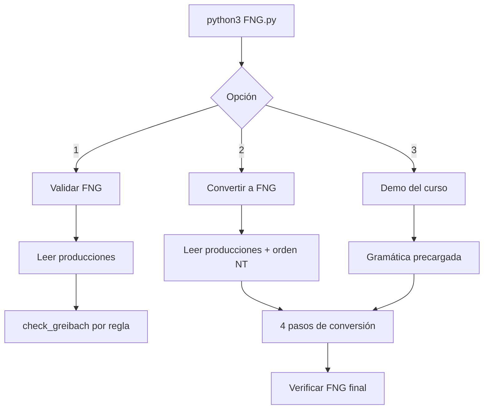

# Guía paso a paso: FNG.py

## Qué hace el script

`FNG.py` trabaja con **gramáticas libres de contexto** representadas como listas de producciones `Variable -> cadena`. Ofrece tres caminos desde un menú único:



### Proceso interno (opción 2 y 3)

La conversión ejecuta `to_greibach_normal_form()` en este orden:

| Paso | Qué hace | Objetivo |
|------|----------|----------|
| 1 | `remove_epsilon()` | Quitar producciones ε que no sean del símbolo inicial |
| 2 | `eliminate_left_recursion()` | Romper recursión izquierda con variables auxiliares (`B'`) |
| 3 | `substitute_ordered()` | Sustituir NTs al inicio hasta que cada regla empiece con terminal |
| 4 | `eliminate_internal_terminals()` | Sustituir terminales que no estén al inicio por NTs |

Después aplica limpieza (ε en auxiliares, inalcanzables) y una sustitución final. Con `verbose=True` imprime la gramática **después de cada paso**.

### Proceso interno (opción 1)

No modifica la gramática. Para cada producción tokeniza la cadena y comprueba la forma `A -> aα` (terminal primero, luego solo NTs). Marca ✔ o ✘ por regla.

---

## Demostración 1: Validar gramática en FNG

**Objetivo:** Confirmar que el validador acepta reglas correctas y rechaza una incorrecta.

```bash
python3 FNG.py
```

| Paso | Prompt del programa | Tu entrada | Notas |
|------|---------------------|------------|-------|
| 1 | `Opción [1]:` | `1` | Validar |
| 2 | `Símbolo inicial [S]:` | *(Enter)* | Usa `S` por defecto |
| 3 | `¿Cuántas producciones...?` | `3` | |
| 4 | Producción #1 — `Variable:` | `S` | |
| 5 | Producción #1 — `Producción:` | `aA` | Válida FNG |
| 6 | Producción #2 — `Variable:` | `A` | |
| 7 | Producción #2 — `Producción:` | `bBC` | Válida FNG |
| 8 | Producción #3 — `Variable:` | `B` | |
| 9 | Producción #3 — `Producción:` | `AB` | **Inválida** (empieza con NT) |

**Salida esperada (fragmento):**

```text
S -> aA  ✔ Válida
A -> bBC  ✔ Válida
B -> AB  ✘ No válida
```

**Criterio de éxito:** Dos ✔ y un ✘. El programa termina con `Fin del programa.`

---

## Demostración 2: Validar gramática ya en FNG

**Objetivo:** Verificar que todas las reglas pasan.

| Paso | Entrada |
|------|---------|
| Opción | `1` |
| Símbolo inicial | `S` |
| Cantidad | `3` |
| Reglas | `S -> aA`, `A -> bBC`, `B -> c` |

**Salida esperada:** Tres líneas con ✔ Válida.

---

## Demostración 3: Convertir a FNG (ejemplo manual)

**Objetivo:** Ver la transformación paso a paso con una gramática pequeña.

```bash
python3 FNG.py
```

| Paso | Prompt | Entrada |
|------|--------|---------|
| 1 | Opción | `2` |
| 2 | Símbolo inicial | `A` |
| 3 | Cantidad de producciones | `2` |
| 4 | #1 Variable / Producción | `A` / `CB2` |
| 5 | #2 Variable / Producción | `C` / `2` |
| 6 | Orden de no terminales | `C,A` |

**Qué observar:**

- Bloque `--- Gramática original ---` con `A -> CB2` y `C -> 2`.
- Mensajes de cada paso (1/4 … 4/4) si `verbose` está activo.
- Gramática final donde `A` debe empezar con terminal `2` (p. ej. `A -> 2BC` tras sustituciones).
- Al final, verificación FNG: todas ✔.

**Criterio de éxito:** `is_greibach()` implícito en mensaje final sin ✘.

---

## Demostración 4: Demo del curso (sin teclear reglas)

**Objetivo:** Reproducir el ejemplo del material UTP con un solo Enter.

| Paso | Entrada |
|------|---------|
| Opción | `3` |

**Gramática precargada:**

```text
A -> CB2
B -> BC
B' -> CB'
C -> 2
```

**Orden fijo:** `C, B, B', A`.

**Salida esperada (resultado típico):**

```text
A -> 2BC
B -> 2B''
B'' -> 2B''
C -> 2
```

**Criterio de éxito:** Tras `--- Verificación FNG ---`, todas las producciones ✔.

---

## Validación automática

```bash
python3 -m unittest test_fng.py -v
```

| Test relevante | Qué valida |
|----------------|------------|
| `test_readme_valid_productions` | Reglas del ejemplo de demostración 1 (parte válida) |
| `test_check_greibach_mixed_grammar` | Mezcla válida/inválida |
| `test_full_conversion_demo` | Conversión del demo del curso |
| `test_left_recursion_elimination` | Paso 2 del algoritmo |

**Criterio de éxito:** `Ran N tests` y `OK`.

---

## Errores frecuentes al demostrar

| Síntoma | Causa probable | Solución |
|---------|----------------|----------|
| `Error: entrada inválida` | Cantidad de producciones no numérica | Escribir un entero, p. ej. `3` |
| Regla marcada ✘ inesperada | Terminal no al inicio (`Ba`, `2B2`) | Revisar forma FNG o usar opción 2 |
| Orden de NT incorrecto | Orden manual incompleto | Dejar vacío el orden para inferencia automática |
| `ε` no reconocida | Formato distinto | Usar `ε`, `λ` o cadena vacía |

---

## Referencia rápida de símbolos al ingresar

| Tipo | Ejemplos válidos en terminal |
|------|------------------------------|
| No terminal | `S`, `A`, `B'` |
| Terminal | `a`, `b`, `2` |
| Vacío | `ε` o línea vacía en producción |

Más teoría: [../fng.md](../fng.md).
