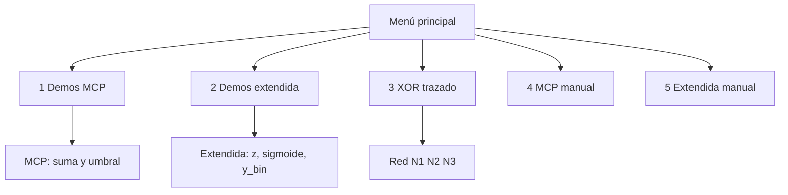

# Guía paso a paso: mcp_neuron.py

## Qué hace el script

`mcp_neuron.py` implementa dos modelos en paralelo:



| Modo | Entrada | Cálculo | Salida |
|------|---------|---------|--------|
| **MCP clásico** | Binaria 0/1 | `suma = Σ w_i·x_i`; dispara si `suma ≥ θ` | `0` o `1` |
| **Extendida** | Real o binaria | `z = Σ w_i·x_i + b`; `y = σ(z)` o escalón | `y` continua + `y_binaria` |
| **XOR** | Binaria 2 entradas | Red de 3 neuronas MCP | `0` o `1` |

**Importante:** XOR **no** se puede con una sola neurona; el script usa red fija N1→N2→N3.

---

## Demostración 1: Todas las compuertas (MCP clásico)

**Objetivo:** Ver tablas de verdad de AND, OR, NOT, ANDNOT y XOR.

```bash
python3 mcp_neuron.py
```

| Paso | Prompt | Entrada |
|------|--------|---------|
| 1 | `Opción:` | `1` |
| 2 | Submenú compuertas | `6` | Todas |

**Resultados esperados (columna Salida):**

| Compuerta | x1=0,x2=0 | x1=0,x2=1 | x1=1,x2=0 | x1=1,x2=1 |
|-----------|-----------|-----------|-----------|-----------|
| AND | 0 | 0 | 0 | 1 |
| OR | 0 | 1 | 1 | 1 |
| NOT x1 | 1 | 1 | 0 | 0 |
| ANDNOT | 0 | 0 | 1 | 0 |
| XOR | 0 | 1 | 1 | 0 |

**Criterio de éxito:** Cada bloque muestra pesos/umbral y cuatro filas coherentes con la tabla.

---

## Demostración 2: ANDNOT y XOR (neurona extendida)

**Objetivo:** Ver `z`, sigmoide y binarización en compuertas no triviales.

| Paso | Entrada |
|------|---------|
| Menú principal | `2` |
| ANDNOT | `4` |
| Volver al menú | `0` |
| Menú principal | `2` |
| XOR | `5` |

**ANDNOT — filas clave:**

| x1 | x2 | z | y_bin (esperado) | MCP salida |
|----|----|---|------------------|------------|
| 1 | 0 | 1.0 | 1 | 1 |
| 1 | 1 | -1.0 | 0 | 0 |

**Criterio:** En modo extendido, `y_binaria` debe coincidir con la columna MCP en las cuatro combinaciones (lo verifican los tests automáticos).

**XOR (modo extendido):** reutiliza la red MCP de 3 neuronas; la columna XOR debe ser `0, 1, 1, 0`.

---

## Demostración 3: Trazado XOR (red de 3 neuronas)

**Objetivo:** Explicar por qué hace falta una red.

| Paso | Entrada |
|------|---------|
| Menú principal | `3` |

**Entrada `x1=1, x2=0` — esperado:**

```text
N1: suma=1, umbral=1 -> 1
N2: suma=0, umbral=1 -> 0
N3: suma=1, umbral=1 -> 1
Salida XOR: 1
```

**Entrada `x1=1, x2=1` — esperado:**

```text
N1: suma=0 -> 0
N2: suma=0 -> 0
N3: suma=0 -> 0
Salida XOR: 0
```

**Criterio de éxito:** Cuatro bloques (una por combinación) con salida XOR `0,1,1,0`.

---

## Demostración 4: Neurona MCP manual (replicar OR)

**Objetivo:** Configurar pesos y probar entradas a mano.

| Paso | Prompt | Entrada |
|------|--------|---------|
| 1 | Opción | `4` |
| 2 | Pesos | `1 1` |
| 3 | Umbral | `1` |
| 4 | `Entradas>` | `0 0` |
| 5 | `Entradas>` | `1 1` |
| 6 | `Entradas>` | `salir` |

**Esperado:**

```text
x1=0, x2=0 | suma=0 | salida=0
x1=1, x2=1 | suma=2 | salida=1
```

---

## Demostración 5: Neurona extendida manual (AND con sigmoide)

| Paso | Prompt | Entrada |
|------|--------|---------|
| 1 | Opción | `5` |
| 2 | Pesos | `1.0 1.0` |
| 3 | Sesgo | `-2.0` |
| 4 | Activación | *(Enter)* → sigmoid |
| 5 | `Entradas>` | `1 1` |
| 6 | `Entradas>` | `1 0` |
| 7 | `Entradas>` | `salir` |

**Esperado:**

| Entradas | z | y (aprox.) | y_binaria |
|----------|---|------------|-----------|
| 1, 1 | 0.0 | 0.5 | 1 |
| 1, 0 | -1.0 | ~0.27 | 0 |

**Equivalencia:** `bias = -θ` → AND con `θ=2` es `bias=-2`.

---

## Demostración 6: Salir del programa

| Paso | Entrada |
|------|---------|
| Menú principal | `0` |

Mensaje: `Fin del programa.`

---

## Validación automática

```bash
python3 -m unittest test_mcp_neuron.py -v
```

| Test | Qué valida |
|------|------------|
| `test_and_gate`, `test_or_gate`, `test_andnot_gate`, `test_not_x1` | Tablas MCP |
| `test_xor_truth_table` | Red XOR completa |
| `test_extended_matches_mcp_presets` | Coherencia MCP ↔ extendida en presets |
| `test_sigmoid_monotonic` | Sigmoide creciente |

**Criterio de éxito:** 12 tests, estado `OK`.

---

## Validación rápida sin menú (una línea)

```bash
cd /ruta/al/proyecto/grammars
printf '1\n6\n0\n' | python3 mcp_neuron.py
```

Debe listar AND, OR, NOT, ANDNOT y XOR sin errores antes de salir.

---

## Errores frecuentes al demostrar

| Síntoma | Causa | Solución |
|---------|-------|----------|
| `Entrada no binaria` | Valor distinto de 0/1 en MCP | Solo 0 y 1 |
| `longitud no coincide` | Menos/más entradas que pesos | Ingresar exactamente N valores |
| XOR con una neurona | Imposible teóricamente | Usar opción 3 o preset XOR |
| `Activación desconocida` | Typo en modo 5 | `sigmoid` o `step` |

---

## Mapa menú ↔ demostración

| Opción menú | Guía sección |
|-------------|--------------|
| 1 + 6 | Demostración 1 |
| 2 + 4, 5 | Demostración 2 |
| 3 | Demostración 3 |
| 4 | Demostración 4 |
| 5 | Demostración 5 |
| 0 | Demostración 6 |

Más teoría: [../mcp_neuron.md](../mcp_neuron.md).
